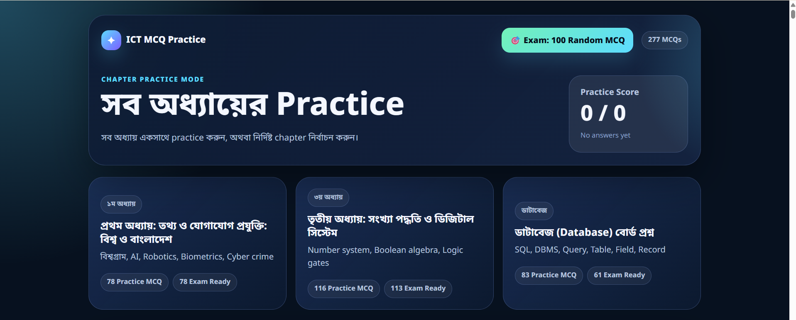
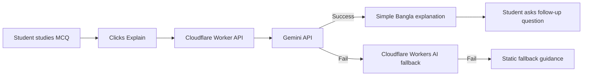
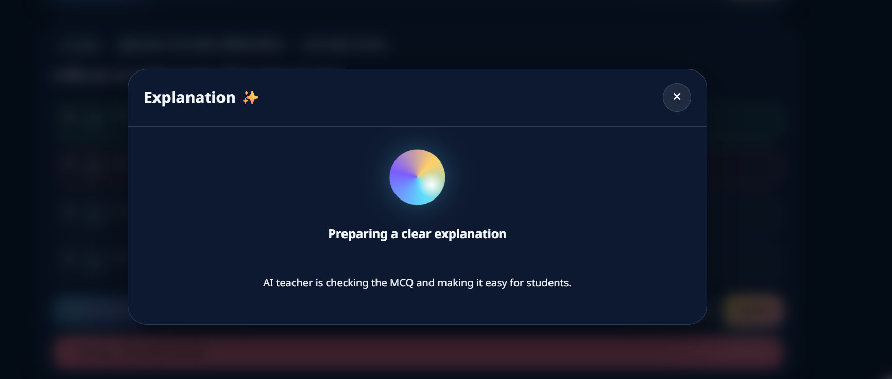
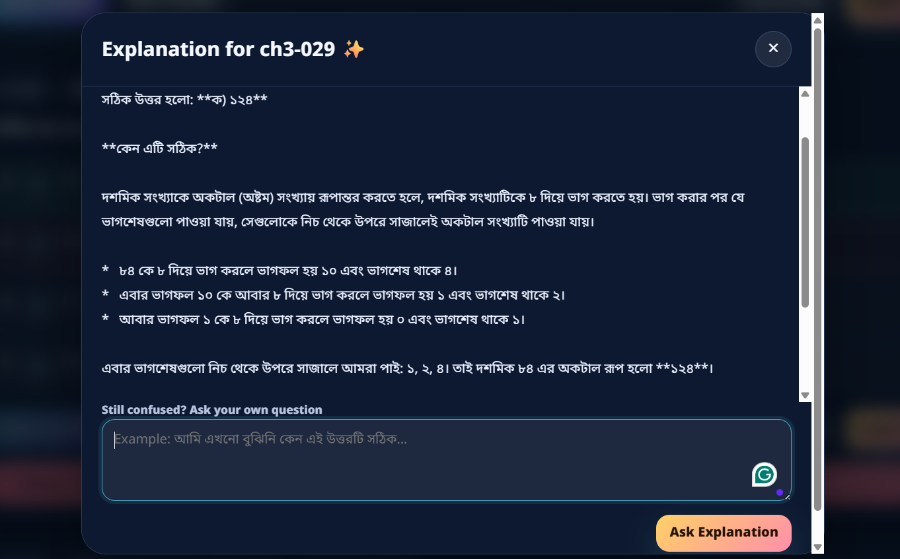
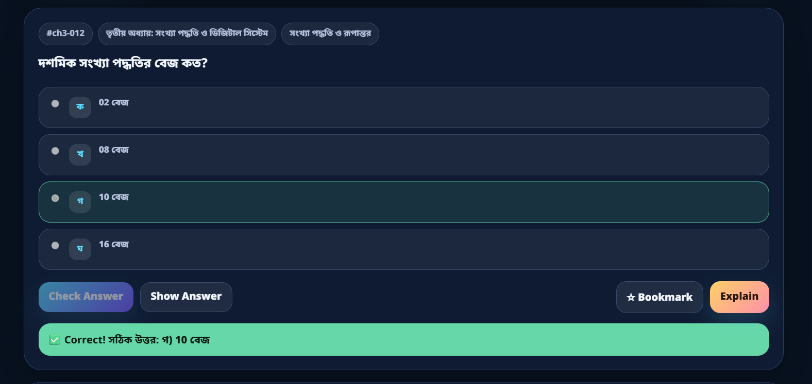
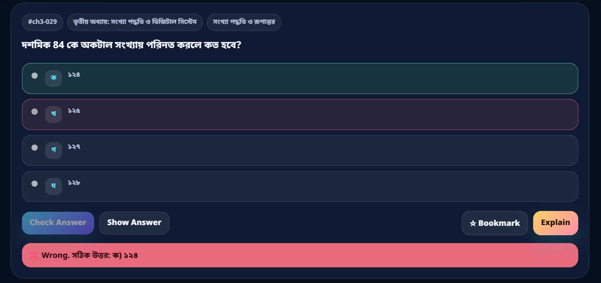
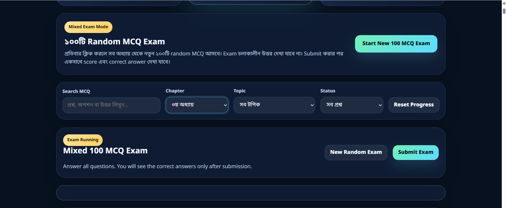
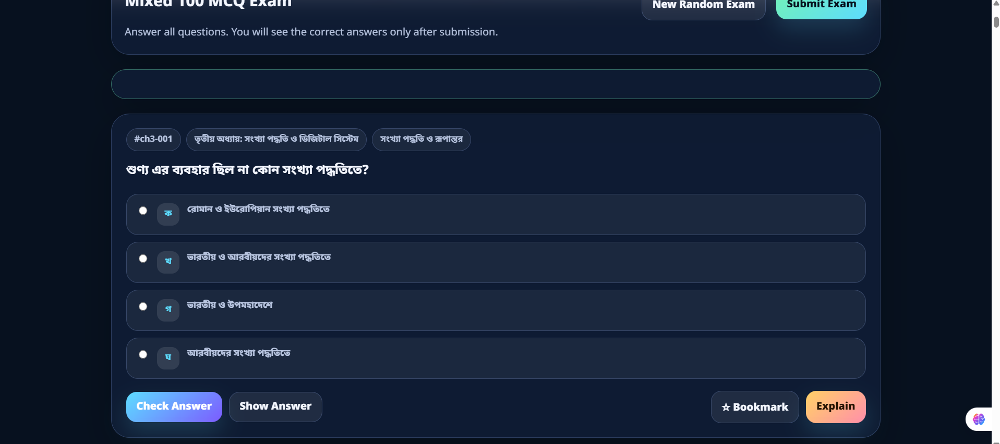
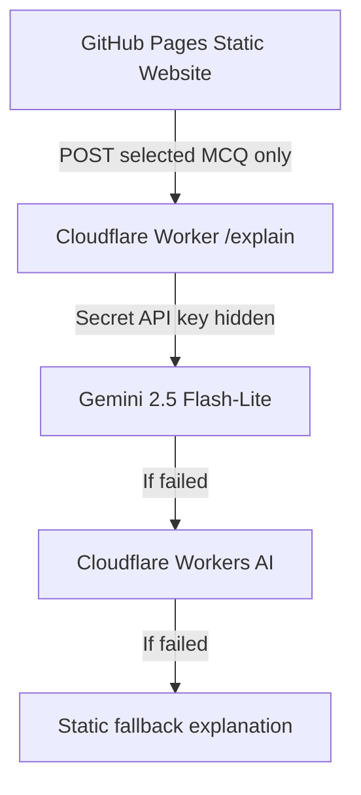

# Live Page 
https://arafat-rahman-lisan.github.io/ict-mcq-practice/

# ICT MCQ Practice — AI-Based Learning Platform

<p align="center">
  
</p>

<p align="center">
  <b>Chapter-wise MCQ practice, 100-random-question exam mode, and AI explanations for daily ICT study.</b>
</p>

---

## ✨ Main Idea

This project is an **AI-assisted MCQ learning website** for ICT students.  
Students can practise chapter by chapter, take a mixed 100-question exam, and use the AI explanation system whenever they do not understand a question.



---

## 🧠 AI-Based Learning Features

| Feature | Purpose |
|---|---|
| **Explain Button** | AI explains the selected MCQ in simple Bangla |
| **Follow-up Question Box** | Student can ask again if still confused |
| **AI Loading State** | Shows that AI teacher is preparing explanation |
| **Gemini + Cloudflare AI Fallback** | If one AI fails, another provider tries |
| **Token Control** | Only one MCQ is sent to AI, not the full question bank |

<p align="center">
  
</p>

<p align="center">
  
</p>

---

## 🎯 Practice + Exam Flow

### Chapter Practice Mode

Students can practise chapter-wise MCQs with instant answer checking and AI explanation.

<p align="center">
  
</p>

<p align="center">
  
</p>

### Mixed 100 MCQ Exam Mode

The exam mode randomly selects **100 MCQs** from all chapters.  
Answers are hidden during the exam and shown only after submission.

<p align="center">
  
</p>

<p align="center">
  
</p>

---

## 🔌 API Integration Snapshot

The frontend never stores the API key.  
It only calls the secure Cloudflare Worker endpoint.

### Frontend Config

```js
window.EXPLAIN_API_URL =
  "https://mcq-gemini-explainer.arafatrahmanlisan.workers.dev/explain";
```

### Frontend Explain Request

```js
async function getAIExplanation(mcq, studentQuestion = "") {
  const prompt = `
প্রশ্ন:
${mcq.question}

অপশন:
${mcq.options.map((opt, i) => `${i + 1}. ${opt}`).join("\\n")}

সঠিক উত্তর:
${mcq.answer}

${studentQuestion ? `শিক্ষার্থীর অতিরিক্ত প্রশ্ন: ${studentQuestion}` : ""}
`;

  const response = await fetch(window.EXPLAIN_API_URL, {
    method: "POST",
    headers: { "Content-Type": "application/json" },
    body: JSON.stringify({ prompt })
  });

  const data = await response.json();
  return data.explanation;
}
```

---

## 🛡️ Secure Backend Design



### Cloudflare Worker Core Logic

```js
// 1. Try Gemini first
try {
  const geminiText = await callGemini(finalPrompt, env);
  if (geminiText) return jsonResponse({ explanation: geminiText, provider: "gemini" }, 200, corsHeaders);
} catch (error) {
  geminiError = error.message;
}

// 2. If Gemini fails, try Cloudflare Workers AI
try {
  const cloudflareText = await callCloudflareAI(finalPrompt, env);
  if (cloudflareText) return jsonResponse({ explanation: cloudflareText, provider: "cloudflare-workers-ai" }, 200, corsHeaders);
} catch (error) {
  cloudflareAIError = error.message;
}

// 3. Final fallback
return jsonResponse({ explanation: makeFallbackExplanation(), provider: "static-fallback" }, 200, corsHeaders);
```

---

## ⚙️ Cloudflare Setup

Required environment variables:

```txt
ALLOWED_ORIGIN = https://arafat-rahman-lisan.github.io
GEMINI_MODEL = gemini-2.5-flash-lite
GEMINI_API_KEY = Secret
```

Required binding:

```txt
Workers AI binding name = AI
```

---

## 📉 How Token Usage Is Controlled

| Problem | Solution |
|---|---|
| Too many MCQs could increase token usage | Send only the selected MCQ |
| 100-MCQ exam could become expensive | Exam mode does not call AI automatically |
| AI response may become too long | Limit output to 600 tokens |
| Repeated failed calls could waste tokens | Try Gemini once, then fallback once |

```js
generationConfig: {
  temperature: 0.4,
  maxOutputTokens: 600
}
```

```js
max_tokens: 600
```

---

## 🚀 Deployment

Frontend:

```txt
GitHub Pages
```

Backend:

```txt
Cloudflare Worker
```

AI providers:

```txt
Gemini API → Cloudflare Workers AI → Static fallback
```

---

## 📌 Project Summary

**ICT MCQ Practice** demonstrates how AI can support daily study without replacing normal learning.  
Students first practise by themselves, then use AI only when they need explanation or clarification.
